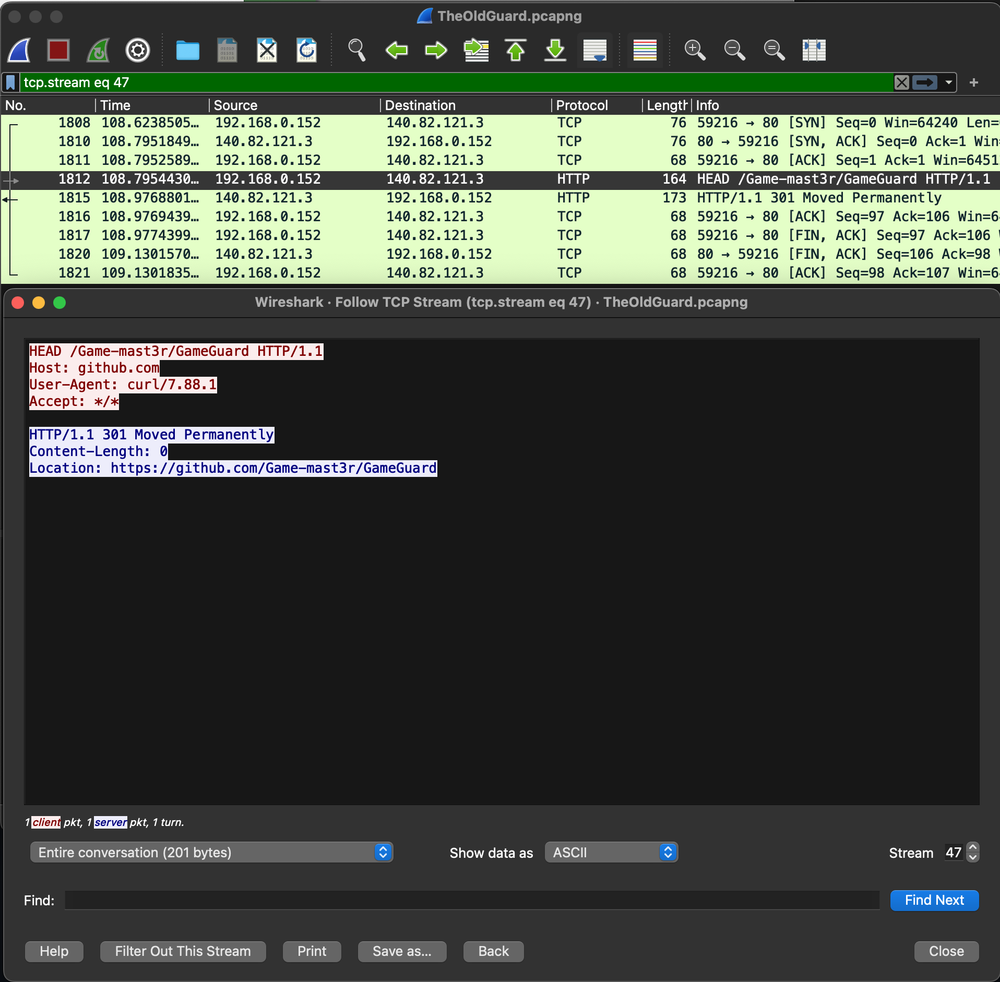

# challenge
Going at this not so tangled web little informations, what do you think the masters have in their vaults ? The masters tried something. 

What is the original url that was accessed from the masters computer ? Flag format: acdfCTF{ 

NOTE: the url should have a proper url format, such as ; protocol://website.com 

I'll advise you to test it on your pc first, make a request maybe via cli or burp or anything you like, intercept or capture it if needs be and see the response. Give it a bit of head. 
[file](./detective-conan-intro/TheOldGuard.pcapng) 

# solution
if we keep following the tcp stream from before, on stream 47, we get: 
 
wrapping it in flag format, you'll get 

# flag
acdfCTF{https://github.com/Game-mast3r/GameGuard} 