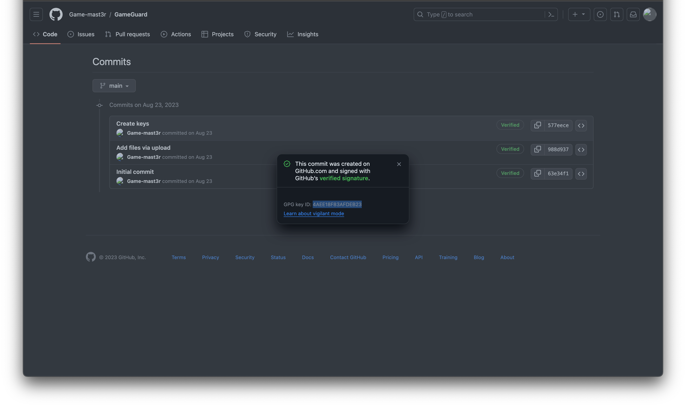

# challenge
Going at this not so tangled web little informations, what do you think the masters have in their vaults ? are you ready to work ? I promise it's not so deep. 

Question: What is the game master's public id ? 

Flag format: acdfCTF{pub...} 

# solution
THIS IS AN UPSOLVE 
going to the github link provided in the previous challenge 
and checking the commits, we'll find the gpg key id 
 
wrap it in the flag format  
voila 
# flag
acdfCTF{4AEE18F83AFDEB23}