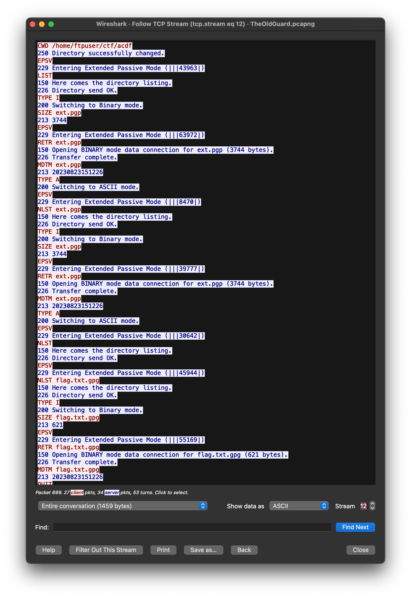
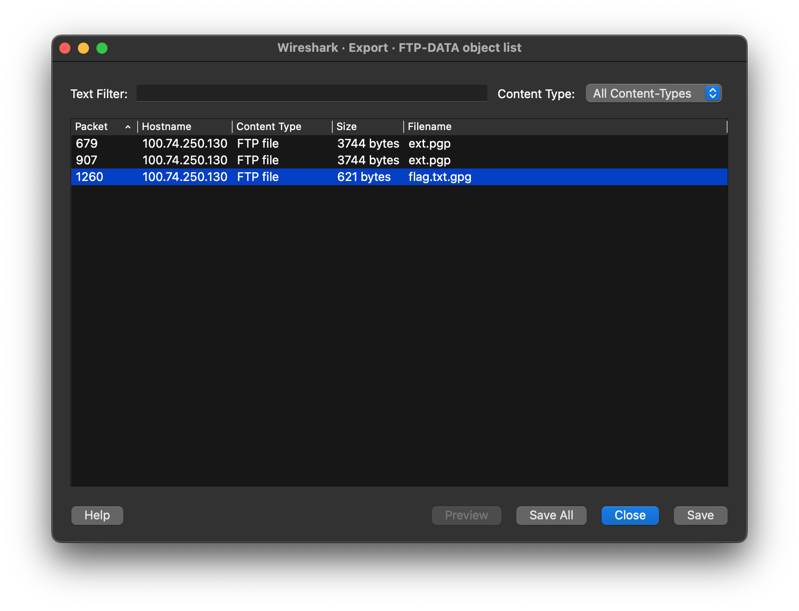
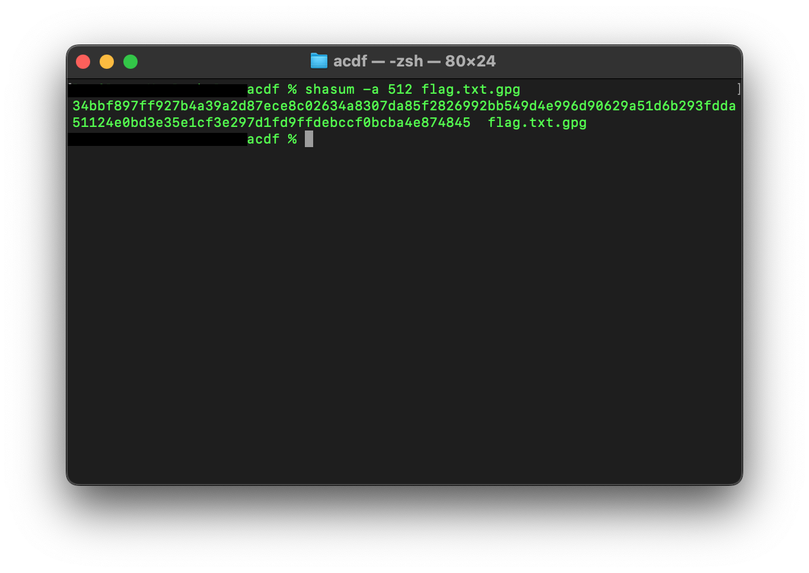

# challenge
You finally were able to listen in on the masters network traffic, you were able to export a bit, but do you know how to tranverse it ?</br> Can you find what you need ?</br>

Okay i'll trust you, you can.</br>

But First what's the sha512sum of the encryted flag ?</br>

Flag format: acdfCTF{</br>
[file](./TheOldGuard.pcapng)</br>
# solution
open the file in wireshark</br>
click on the second packet and follow the tcp stream</br> 
at stream 12 you'll see this:</br>
</br>
which shows that the encrypted flag is flag.txt.gpg was retrieved from the server and hence in the file capture file</br>
click on file and export objects and under ftp-data you'll find :</br>
</br>
save the file </br>
compute the sha512sum using</br>
```
shasum -a 512 flag.txt.gpg
```
</br>
 voila!</br
>

# flag
acdfCTF{34bbf897ff927b4a39a2d87ece8c02634a8307da85f2826992bb549d4e996d90629a51d6b293fdda51124e0bd3e35e1cf3e297d1fd9ffdebccf0bcba4e874845}