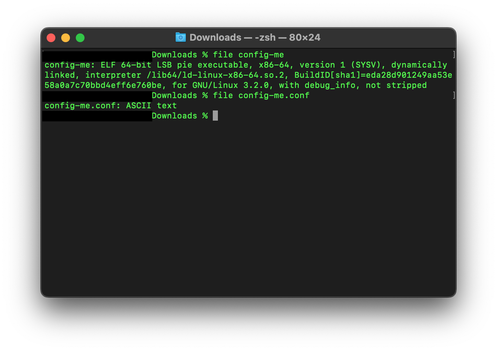
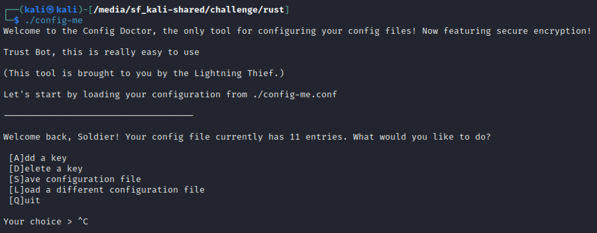
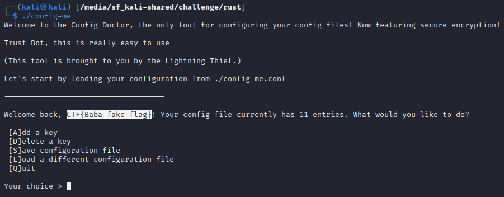
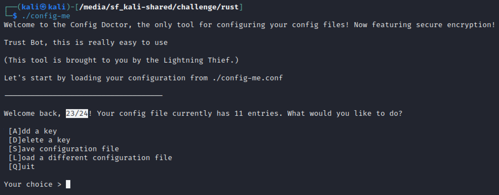
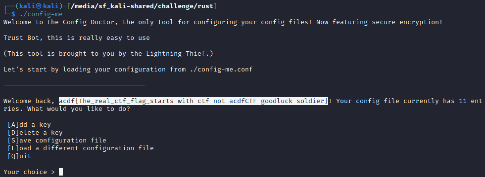
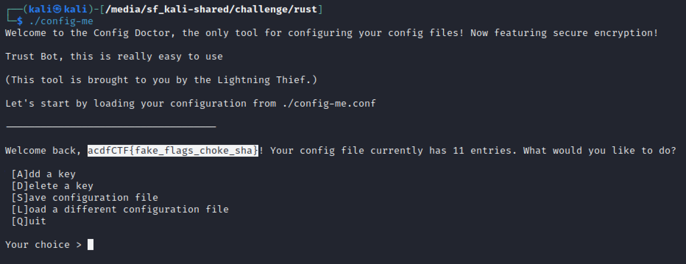
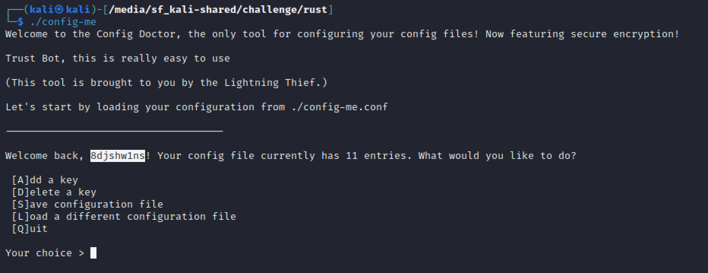
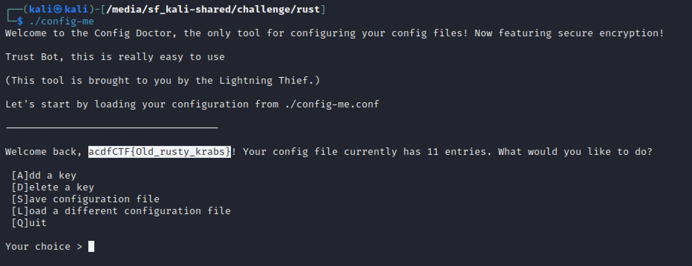
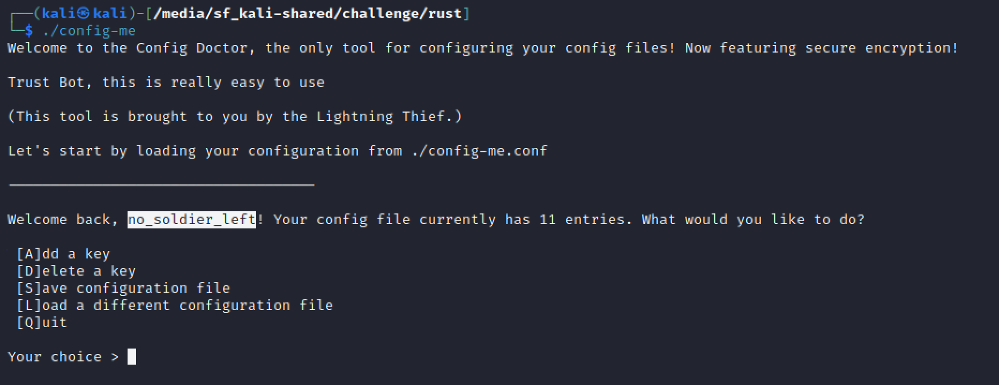

# challenge
Ol' rusty rickets pls configure me properly, I promise to be good xD 

NOTE: this is the only challenge that the flag is different a little bit, I might be joking but have fun 
[file1](./config-me) [file2](./config-me.conf) 

# solution
run file on the files 
file1 is an [elf-file](https://en.wikipedia.org/wiki/Executable_and_Linkable_Format) 
and file2 is a a configuration file 
incase you don't believe me: 
 
i googled "rust ctf challenge"(because i was learning on the job lol) and stumbled across [this](https://github.com/xxg1413/rust-ctf) 
i clicked on "BSidesSF 2020 CTF:config-me" because it seemed familiar (because of the file names) and ended up with this [writeup](https://ctftime.org/writeup/18517) 
i followed their footsteps and closed ghidra 
the key is to replace the name value with the encrypted strings and the program will automatically decode it for you 
shout out to the troll involved in making this challenge 
default config 
 
with pass value replacing the name value 
 
with kit value replacing the name value 
 
with flag value replacing the name value. this nearly sent me down a rabbit hole 
 
with mail value replacing the name value. i was just burst out laughing at this point 
 
with ctf value replacing the name value 
 
with password value replacing the name value. flag at last 
 
with password value replacing the name value 
 
voila! 

# flag
acdfCTF{Old_rusty_krabs}