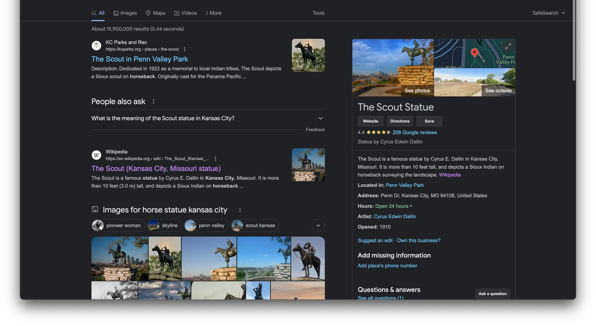

# challenge
Find where's this (City name), what artwork is where the picture was taken from, creator of the artwork 

an example flag format: acdfCTF{Lagos,Dey_Play,Burna_Boy} 
[file](./osint9.png) 

# solution
check exif data(google "john mcafee exif data"), nothing interesting 
ran strings, normal stuff 
slapped it into google reverse image search and we get hits.  
 
most of the results have kansas in them so we can assume the city is kansas. we can use the 2 white dishes? towards the left of our image to confirm it's the same place  
in this particular result we see a horse statue. a google search solves the rest 
 
the name of the statue is "the scout"(you can see the ackermann reference now). artist's name is Cyrus Edwin Dallin. 
 
combining all our pieces together we get our flag 
voila! 

# flag
acdfCTF(Kansas,The_Scout,Cyrus_Edwin_Dallin)