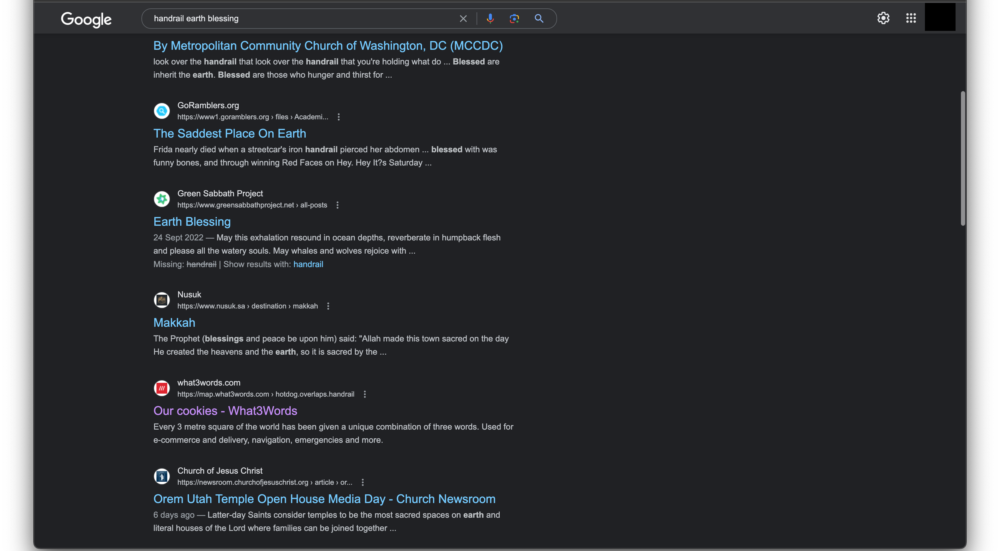
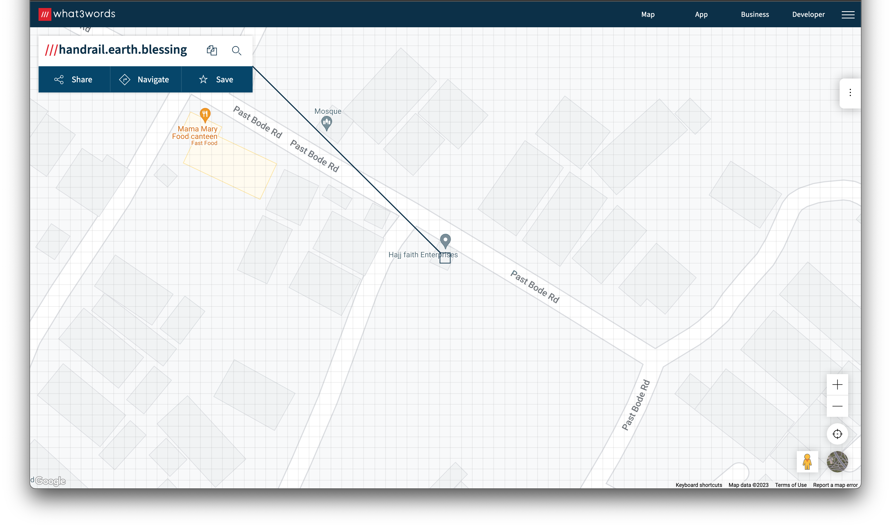

# challenge
Aduke said she wants to go get her phone charger somewhere, but it's been past 4 hours now, and she's yet to be back. I can't contact her, but she has a habit of noting her location in her little jotter. 
I checked and found this incomprehensible word* 'handrailearthblessing,'* and I don't know what to do with it. Can you help me find where she went? 

Flag Format: acdfCTF{Something_is_here} 

# solution
mẹta is 3 in yoruba 
take note of "location" 
a google search of the string "handrailearthblessing" doesn't yield a result but google suggests we seperate them into 3 words
when we search that and scroll down a bit we stumble across [this](https://map.what3words.com/about) 
 
going the homepage and typing the words, we realise we're meant to seperate the words by a full stop and have 3 forward slashes in front of the text 
click on search and we get: 
 
Hajj faith enterprises 
wrapping it in our flag format, we get the flag 
voila! 

# flag
acdfCTF{Hajj_faith_Enterprises}