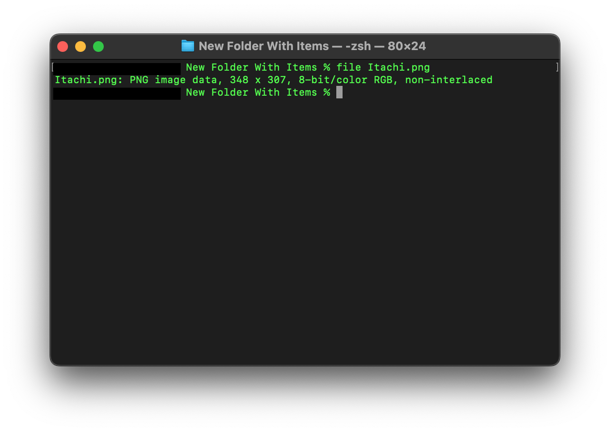
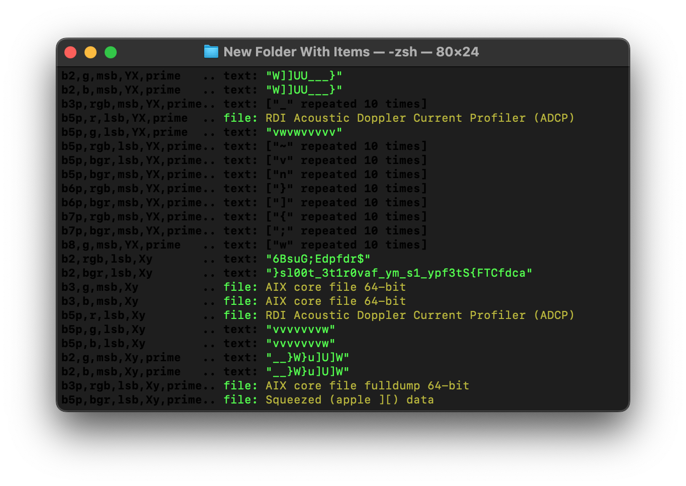

# challenge
You have to use your inner sharingan to unlock the secret.</br>
[file](./Itachi.png)</br>

# solution
run file command on the file given to check if the extension is what it claims to be</br>
it's a png fi</br>le.
pass it through zsteg using</br> 
```
zsteg -a Itachi.png
```
</br>
we get:</br>
</br>
oh nein! it's reversed.</br>
copy the text</br>
reverse it with python as shown below </br>
</br>
you can also use any online text reversing tool you want</br>
voila!</br>

# flag
acdfCTF{St3fpy_1s_my_fav0r1t3_t00ls</br>