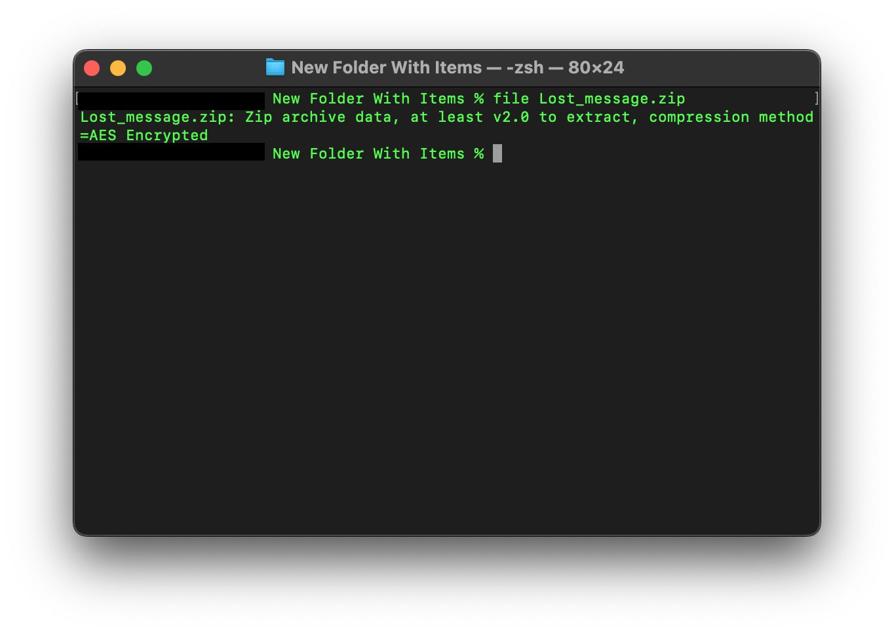
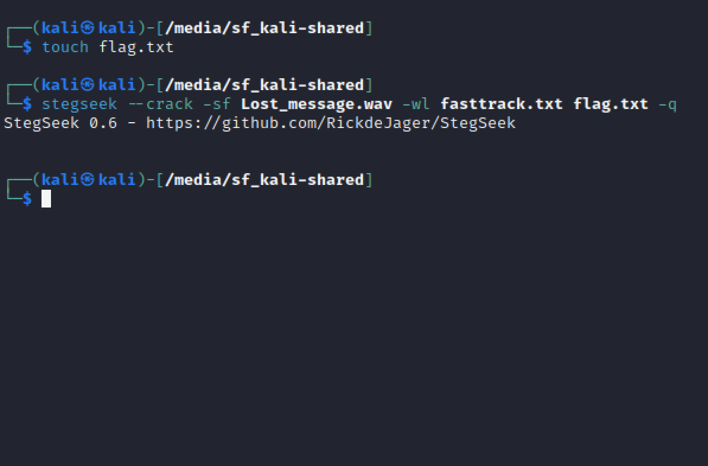

# challnege
I received an Audio named "Lost Message," and I was tasked with uncovering the concealed message within it. However, I'm having some difficulty understanding it completely.</br>

Zip Password: Cyberlympics2023</br>

Flag Format: acdfCTF{}</br>

[file](./Lost_message.zip)</br>

# solution
THIS IS AN UPSOLVE!</br>
run file command on the file given to check if the extension is what it claims to be</br>
extract the file using the password given.</br>
it's a wav file that has a constant pitch?</br>
using [stegseek](https://github.com/RickdeJager/StegSeek) and [fasttrack](https://github.com/drtychai/wordlists/blob/master/fasttrack.txt) wordlist, we crack the wav file. </br>
before running our command, we have to create our output file </br>
```
touch flag.txt
```
</br>
then we run:</br>
```
stegseek --crack -sf Lost_message.wav -wl fasttrack.txt flag.txt -q
```
</br>
-- crack - crack option</br>
-sf stegofile</br>
-wl wordlist</br>
-q quiet mode(no output on the console)</br>
</br>
let's open our flag.txt file.</br>
</br>
wow! such empty (or is it *bombastic side eye*)</br>
we can select some stuff?</br>
</br>
there's something called whitespace language</br>
using [dcode](https://www.dcode.fr/whitespace-language)(bless their hearts)</br> 
upload the flag.txt file</br> 
we get some text and we think oh no we've gone down another rabbit hole, then we see our flag shining in it's glory</br>
</br>
voila!
# flag
acdfCTF{Wh1t3sp4c3_l4ngu4g3_1s_my_7h1ng}