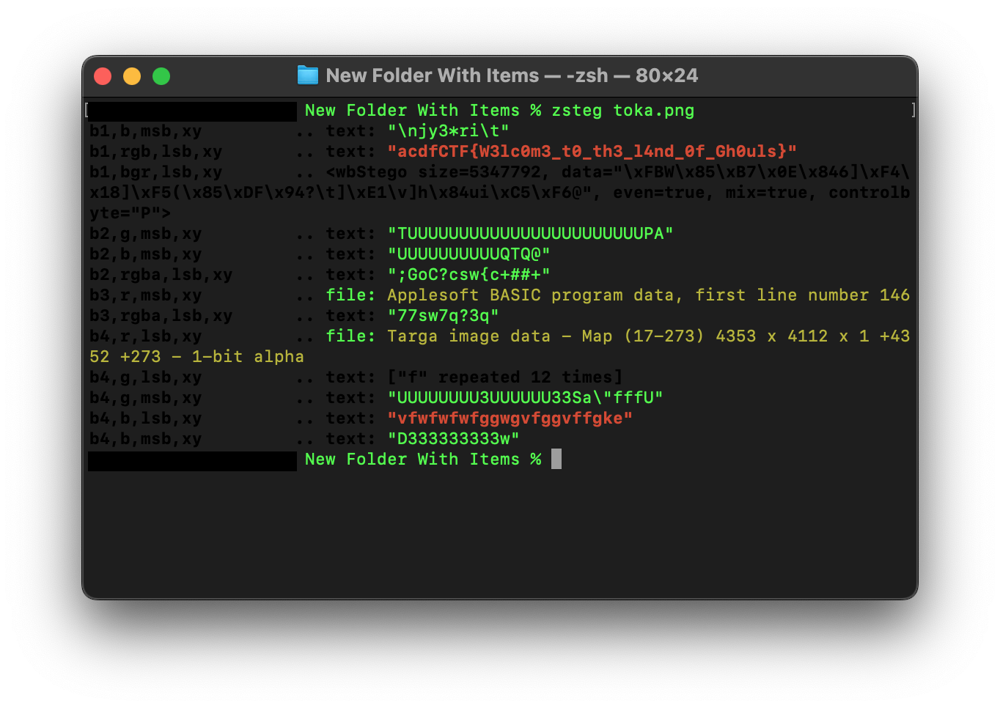

# challenge
Can you find the hidden flag?</br>
[file](./toka.jpg)</br>

# solution
run file command on the file given to check if the extension is what it claims to be</br>
we find out that the jpg extension is cosplaying and it's actually a png file</br>
</br>
using the following zsteg command</br>
```
zsteg toka.png
```
</br>
we get:</br>
</br>
voila!</br>

# flag
acdfCTF{W3lc0m3_t0_th3_l4nd_0f_Gh0uls}</br>